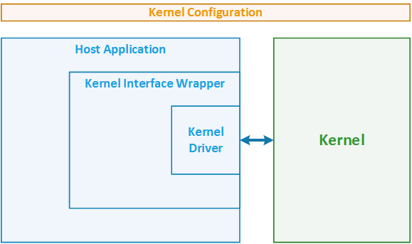
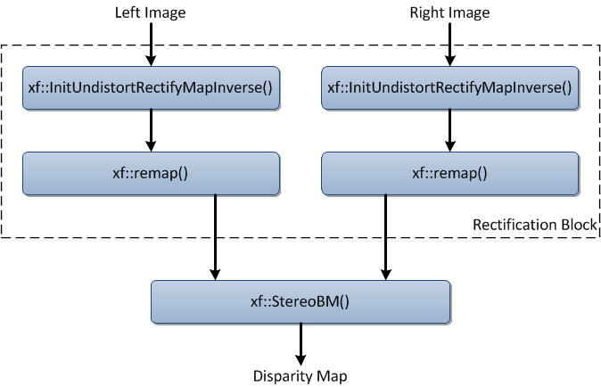

# Stereo Pipeline #

Disparity map generation is one of the first steps in creating a three dimensional map of the environment. The xfOpenCV library has components to build an image processing pipeline to compute a disparity map given the camera parameters and inputs from a stereo camera setup.

Example demonstrates using of **`xf::InitUndistortRectifyMapInverse()`**, **`xf::remap()`** and **`xf::StereoBM()`** functions of xfOpenCV library in pipeline to compute disparity map. Example designed to process one image set (image from left and right cameras) once. If you would like to process many sets of images in loop you need to extract from kernel interface wrapper FPGA & kernel initialization and finalization operations and move them to host application before and after processing loop respectively.

## Code structure ##



| Component | Source files |
| :-        | :-           |
| *Kernel&nbsp;Configuration*          |**`xf_stereo_pipeline_config.h`**<br/>**`xf_config_params.h`**<br/>**`cameraParameters.h`**|
| *Host&nbsp;Application*              |**`xf_stereo_pipeline_tb.cpp`**|
| *Kernel&nbsp;Interface&nbsp;Wrapper* |**`xf_stereo_pipeline_accel_aws.cpp`**|
| *Kernel&nbsp;Driver*                 |**`xcl2.cpp (in SDx library)`**|
| *Kernel*                             |**`xf_stereo_pipeline_kernel_aws.cpp`**|

## Kernel Configuration #

Following constants in header files define kernel configuration

| Constant | Possible values | Default Value | Description |
| :-       | :-              | :-            | :-          |
| **`XF_WIDTH`**             |**`> 0`**|**`1280`**|Maximum width of input image|
| **`XF_HEIGHT`**            |**`> 0`**|**`720`**|Maximum height of input image|
| **`XF_CAMERA_MATRIX_SIZE`**|**`9`**|**`9`**|Number of element in camera coordinate system matrix (9 == 3 x 3 matrix)|
| **`XF_DIST_COEFF_SIZE`**   |**`4, 5, 8`**|**`5`**|Size of array with distortion coefficients|
| **`NO_OF_DISPARITIES`**    |**`0 < value < XF_WIDTH &&`**<br/>**`value >= PARALLEL_UNITS &&`**<br/>**`value % PARALLEL_UNITS == 0`**| **`48`**| Number of disparities |
| **`PARALLEL_UNITS`**       |**` > 0`**|**`16`**|Number of disparities to be computed in parallel|
| **`SAD_WINDOW_SIZE`**      |**`value % 2 == 1 &&`**<br/>**`> minimum image heght &&`**<br/>**`< 21`**|15|Size of the window used for disparity computation|
| **`XF_REMAP_BUFSIZE`**     |**`> 0`**|**`128`** |Number of input image rows to be buffered inside **`xf::remap()`**|

## Host Application ##
Host application reads two test images from file (images of left and right cameras) and forward them with cameras matrices, distortion coefficients and transformation matrices predefined in **`cameraParameters.h`** to the kernel for disparity map computation.

Input images of example **_left.png_** and **_right.png_** placed in root folder of example. Disparity map calculated in kernel writing as image to **_hls_output.png_**.


## Kernel Interface Wrapper ##

In conjunction with xfOpenCV library on host application is convenient to use xf::Mat or cv::Mat class and image manipulation functions. Unfortunately the XOCC kernel compiler doesn't support classes/structures as kernel input/output parameters. To pass xf::Mat to a kernel a wrapper is needed. The kernel interface wrapper convert interface convenient to host application to kernel interface available in Amazon F1 instance.

For this example kernel interface wrapper also perform FPGA initialization, kernel downloading, initialization and finalization.


| Parameter&nbsp;Name |Direction|Type | Description |
| :-                  | :-      | :-  | :-          |
| **`xf_img_l`**      |Input | **`xf::Mat<XF_8UC1, XF_HEIGHT,`**<br/>**`XF_WIDTH, XF_NPPC1> &`**  | Input image from left camera |
| **`xf_img_r`**      |Input | **`xf::Mat<XF_8UC1, XF_HEIGHT,`**<br/>**`XF_WIDTH, XF_NPPC1> &`**  | Input image from right camera |
| **`xf_img_d`**      |Output| **`xf::Mat<XF_16UC1, XF_HEIGHT,`**<br/>**` XF_WIDTH, XF_NPPC1> &`**| Output disparity map |
| **`bm_state`**      |Input | **`xf::xFSBMState<SAD_WINDOW_SIZE,`**<br/>**`NO_OF_DISPARITIES, PARALLEL_UNITS> &`**       | Set of various parameters regarding the stereo block matching algorithm |
| **`cameraMA_l_fix`**|Input | **`ap_fixed<32,12>`**| Left  camera parameters matrix        |
| **`cameraMA_r_fix`**|Input | **`ap_fixed<32,12>`**| Right camera parameters matrix        |
| **`distC_l_fix`**   |Input | **`ap_fixed<32,12>`**| Left  image distortion coefficients   |
| **`distC_r_fix`**   |Input | **`ap_fixed<32,12>`**| Right image distortion coefficients   |
| **`irA_l_fix`**     |Input | **`ap_fixed<32,12>`**| Left  image transformation matrix     |
| **`irA_r_fix`**     |Input | **`ap_fixed<32,12>`**| Right image transformation matrix     |
| **`cm_size`**       |Input | **`int`**            | Size of camera parameters matrix      |
| **`dc_size`**       |Input | **`int`**            | Size of distortion coefficients array |

To forward these parameters to kernel wrapper create 10 buffers in global memory for images data, disparity map and transformation parameters matrices & arrays. Wrapper decompose **`xf_img_l`**, **`xf_img_r`**, **`xf_img_d`** and **`bm_state`** classes and pass member separately. Not all members of **`bm_state`** wrapper transfers to kernel. Most members of **`bm_state`** is predefined by template or calculated based on others members. Therefore kernel could fully restore values of host side **`bm_state`** based on template and restricted set of values. Wrapper forward as regular parameters of type **`int`** following members of **`bm_state`**: **`preFilterType`**, **`preFilterCap`**, **`minDisparity`**, **`textureThreshold`**, **`uniquenessRatio`** 


## Kernel Driver ###

Example use modification of SDx xcl kernel driver v.2 for Amazon F1 instance. Source code of this driver and description could be found in Amazon aws-fpga framework.

## Kernel ##

To calculate disparity map the kernel pipeline functions from xfOpenCV as shown on the image below.<br/>



The kernel has following parameters:

| Parameter&nbsp;Name |Direction|Type | Description |
| :-                  | :-      | :-  | :-          |
| **`img_l`**         |Input | **`XF_TNAME(XF_8UC1, XF_NPPC1) *`** | Pointer to input image buffer from left  camera       |
| **`img_r`**         |Input | **`XF_TNAME(XF_8UC1, XF_NPPC1) *`** | Pointer to input image buffer from right camera       |
| **`cameraMA_l_fix`**|Input | **`ap_fixed<32,12> *`**             | Pointer to buffer with left  camera parameters matrix |
| **`cameraMA_r_fix`**|Input | **`ap_fixed<32,12> *`**             | Pointer to buffer with right camera parameters matrix |
| **`distC_l_fix`**   |Input | **`ap_fixed<32,12> *`**             | Pointer to buffer with left  image distortion coefficients |
| **`distC_r_fix`**   |Input | **`ap_fixed<32,12> *`**             | Pointer to buffer with right image distortion coefficients |
| **`irA_l_fix`**     |Input | **`ap_fixed<32,12> *`**             | Pointer to buffer with left  image transformation matrix   |
| **`irA_r_fix`**     |Input | **`ap_fixed<32,12> *`**             | Pointer to buffer with right image transformation matrix   |
| **`img_d`**         |Output| **`XF_TNAME(XF_16UC1, XF_NPPC1) *`**| Pointer to buffer for output disparity map                 |
| **`preFilterType`**<br/>**`preFilterCap`**<br/>**`minDisparity`**<br/>**`textureThreshold`**<br/>**`uniquenessRatio`**<br/>| Input | **`int`**|Restricted set members of **`xf::xFSBMState<...>`** structure which have arbitrary values. This set is enough to restore values of all member of **`xf::xFSBMState<...>`** same as on host side|
| **`cm_size`**       |Input | **`int`**                           | Size of camera parameters matrix     |
| **`dc_size`**       |Input | **`int`**                           | Size of distortion coefficients array|
| **`rows`**          |Input | **`int`**                           | Height of images and disparity map|
| **`cols`**          |Input | **`int`**                           | Width  of images and disparity map |


During synthesis for FPGA kernel's parameters should be mapped to HW interfaces supported on Amazon F1 instance. To map kernel parameters **`HLS INTERFACE`** pragma should be used. Supported following interfaces: **`m_axi`** and **`s_axilite`**. For **`m_axi`** offset can be set through **`s_axilite`** port only.

Because functions from xfOpenCV library operate with **`xf::Mat`** class as image container kernel's parameters should be packed back to objects of this class. To do this you need following: 

- Declare **`xf::Mat`** variable <br/> ***Note: due to XOCC issues use default constructor only - do not try initialize class members with help of non-default constructors***
- Assign image size to **`rows`** and **`cols`** members
- Copy image from input buffer to **`data`** member of **`xf::Mat`** or from **`data`** to output buffer

```cpp
xf::Mat<XF_8UC1, XF_HEIGHT, XF_WIDTH, XF_NPPC1> xf_img_l;
xf::Mat<XF_8UC1, XF_HEIGHT, XF_WIDTH, XF_NPPC1> xf_img_r;

xf_img_l.rows = rows; xf_img_l.cols = cols;
xf_img_r.rows = rows; xf_img_r.cols = cols;

for(int i=0; i < rows; i++)
  {
    #pragma HLS LOOP_TRIPCOUNT min=1 max=pROWS

    for(int j=0; j < (cols >> (XF_BITSHIFT(XF_NPPC1))); j++)
      {
        #pragma HLS LOOP_TRIPCOUNT min=1 max=pCOLS/pNPC
        #pragma HLS PIPELINE
        #pragma HLS loop_flatten off

        *(xf_img_l.data + i*(cols >> (XF_BITSHIFT(XF_NPPC1))) +j) = *(img_l + i*(cols >> (XF_BITSHIFT(XF_NPPC1))) +j);
        *(xf_img_r.data + i*(cols >> (XF_BITSHIFT(XF_NPPC1))) +j) = *(img_r + i*(cols >> (XF_BITSHIFT(XF_NPPC1))) +j);         
      }
  }
```
**Note: `#pragma HLS` doesn't support constants defined through **`#define`** directive - use `const int`. In the code above `pROWS`, `pCOLS` and `pNPC` are `const int` variables which get values from constants defined in xf_stereo_pipeline_config.h with help of #define directive**

```cpp
const int pROWS = XF_HEIGHT;
const int pCOLS = XF_WIDTH;
const int pNPC  = XF_NPPC1;
```

Simple declaration of **`xf::Mat`** object create buffer to store whole image with maximum defined size. This buffer use FPGA internal memory blocks and even big FPGA devices could not have enough resources. You should use **`#pragma HLS stream`** to ask HLS convert big RAM buffer to small FIFO buffer 

```cpp
xf::Mat<XF_8UC1, XF_HEIGHT, XF_WIDTH, XF_NPPC1> xf_img_l;
xf::Mat<XF_8UC1, XF_HEIGHT, XF_WIDTH, XF_NPPC1> xf_img_r;

#pragma HLS stream variable=xf_img_l.data  depth=pCOLS/pNPC 
#pragma HLS stream variable=xf_img_r.data depth=pCOLS/pNPC 
```

Please note that **`#pragma HLS stream`** could be used inside dataflow block, therefore kernel body should be declared as dataflow. This also permit pipeline functions from xfOpenCV library.

```cpp
void kernel(...)
{
  #pragma HLS INTERFACE ...
  #pragma HLS INTERFACE ...
  
  #pragma HLS dataflow
  ...
}
```

## Known Issues

- #### Kernel can't accept class/structure as parameters
**Solution**: use simple types, pass class/structure members as separate parameters of simple types and compose class/structure object back inside kernel.

- #### Using non-default constructors can cause kernel suspension on FPGA and HW emulation
**Solution**: use default constructor for object declaration and next assign desired values to the members separately.

```cpp
xf::Mat<XF_8UC1, XF_HEIGHT, XF_WIDTH, XF_NPPC1> xf_img_l;
xf::Mat<XF_8UC1, XF_HEIGHT, XF_WIDTH, XF_NPPC1> xf_img_r;

xf_img_l.rows = rows; xf_img_l.cols = cols;
xf_img_r.rows = rows; xf_img_r.cols = cols;
```

- #### **`#pragma HLS`** doesn't support constants defined through **`#define`** directive.
**Solution**: use **`const int`** instead


```cpp
#define XF_HEIGHT 720

void kernel(...)
{
  const int pROWS = XF_HEIGHT;

  for(int i=0; i < rows; i++)
    {
      #pragma HLS LOOP_TRIPCOUNT min=1 max=pROWS
      ...
    }
  ...
}
```


## Revision History

Date      | Readme Version | Release Notes
--------  |----------------|-------------------------
May 2018  | 1.0            | Initial version.
